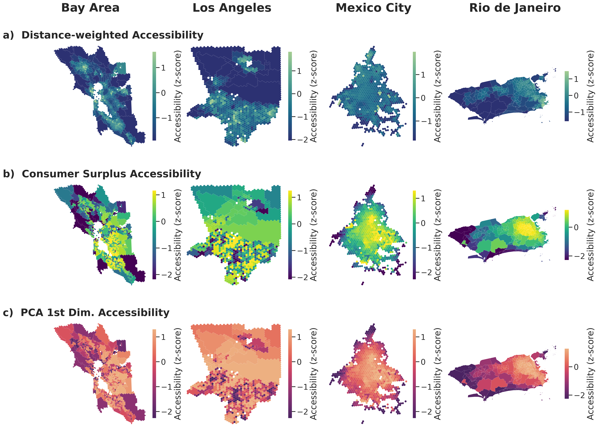

# WorkReach: Modeling Urban Work Location Choices Through Economic Complexity, Informality, and Mobility Data

## Abstract

Human mobility in urban areas largely depends on the spatial distribution of economic opportunities, yet our understanding of how workers balance the trade-off between proximity and job quality is still limited. Existing mechanistic models of trip distributions capture physically interpretable effects such as distance decay or intervening opportunities, but they do not account for how socioeconomic factors influence commuting decisions. Here we introduce the WorkReach model, which, grounded in discrete choice theory, reveals a behavioral principle that characterizes how rational agents select work locations. By incorporating for the first time residential informality and the economic complexity of jobs into its utility function, the model quantifies how workers trade distance for job quality depending on their socioeconomic context. The results reconstruct flows with accuracy comparable to widely used benchmarks with added information in the choice mechanisms. Applied to four cities in the U.S. and Latin America, the framework highlights a universal preference for economically sophisticated areas, while also revealing marked regional differences in how workers balance this trade-off. Moreover, by defining accessibility as the perceived utility of opportunities rather than only physical proximity, WorkReach offers new insights into assessing urban inequality.

## Overview

This repository contains the code and analysis for the WorkReach paper. A discrete choice framework that models urban work location choices by incorporating economic complexity, labor informality, and human mobility.

## Areas of Study

The analysis covers four major urban areas:
- San Francisco Bay Area, USA
- Los Angeles, USA
- Mexico City, Mexico
- Rio de Janeiro, Brazil

## Requirements

- Python 3.8+
- See `requirements.txt` for package dependencies

## Key Results

### Spatial Distribution of Economic Complexity and Informality

The four cities exhibit distinct spatial patterns in both Economic Complexity Index (ECI) and informality rates. Both variables show significant spatial autocorrelation, with Latin American cities displaying moderate negative correlation between informality and ECI (ρ ∼ −0.4), indicating spatial segregation where informal workers live far from high-complexity economic areas. In contrast, U.S. cities show near-zero correlation (ρ ∼ 0), suggesting more mixed spatial arrangements.

### Multi-scale Economic Structure and Mobility Patterns

The analysis reveals distinct specialization patterns across cities, with the Bay Area showing higher Product Complexity Index (PCI) in information sectors. U.S. cities exhibit longer commute distances, while disaggregating by socioeconomic characteristics shows that workers from high-informality areas in Latin America travel farthest to reach high-ECI destinations, whereas in U.S. cities, the longest commutes are made by workers from low-informality areas.

### WorkReach Model Framework

The WorkReach model integrates commuting distance, economic complexity, and informality into a utility function with a behavioral transition mechanism. The model distinguishes between "near-by" and "far-away" regimes based on a distance threshold τ, where socioeconomic factors (ECI and informality) become increasingly important for distant work choices.

### Model Performance Comparison

WorkReach achieves competitive performance with established spatial interaction models across all four cities. The model demonstrates comparable predictive accuracy while providing enhanced interpretability through behavioral coefficients that reveal how workers trade distance for job quality.

### Accessibility Analysis

Distance-weighted accessibility shows contrasting patterns: U.S. cities exhibit higher median values for high-informality neighborhoods, while Latin American cities show the opposite. However, consumer-surplus accessibility (incorporating job quality and behavioral preferences) consistently shows lower values for high-informality origins across all cities, revealing disparities masked by purely distance-based measures.

The spatial distribution of accessibility measures reveals peripheral locations, especially in western Rio de Janeiro, as the most underserved areas. The combined accessibility measure (PCA first dimension) identifies regions with advantages or disadvantages in both physical proximity and utility-based attractiveness.

## Usage
Currently, the final to produce all results is in the `commuter_flows.qmd` file which is a Quarto notebook (using Python). You can run this file to reproduce the analysis and figures in the paper.

## Authors

- **Ollin D. Langle-Chimal** - University of California, Berkeley (ollin18)
- **Steffen Knoblauch** - Heidelberg University
- **Marta C. González** - University of California, Berkeley

## Contact

For questions about the methodology or code, please contact the corresponding authors or open an issue in this repository.
