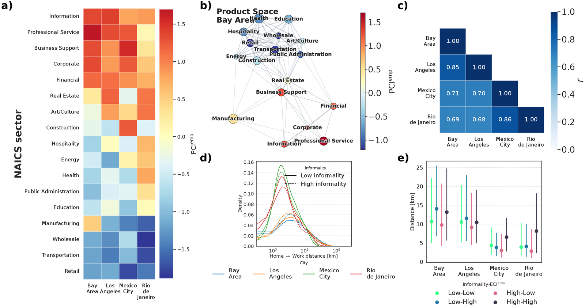
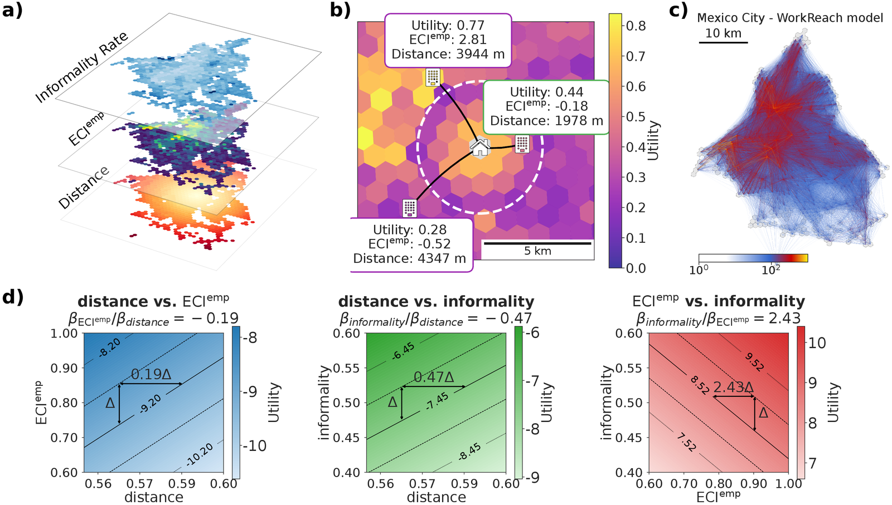
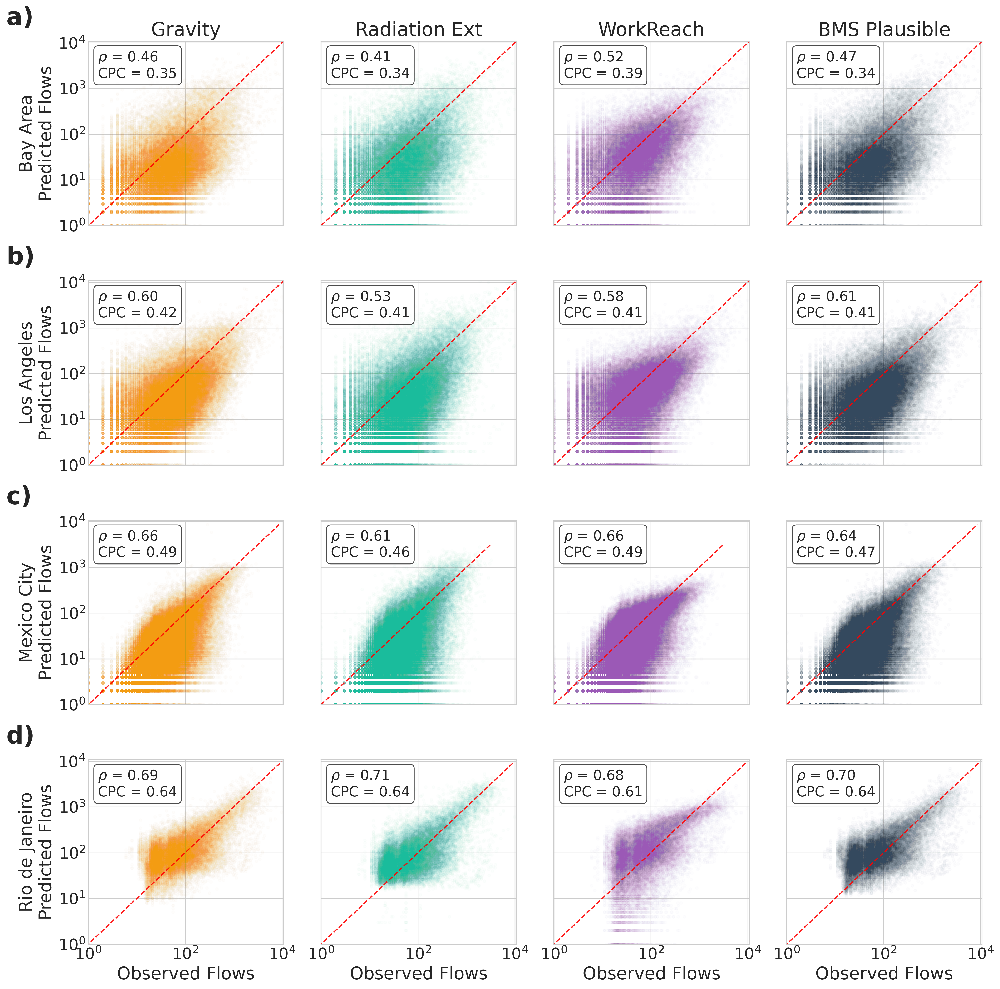
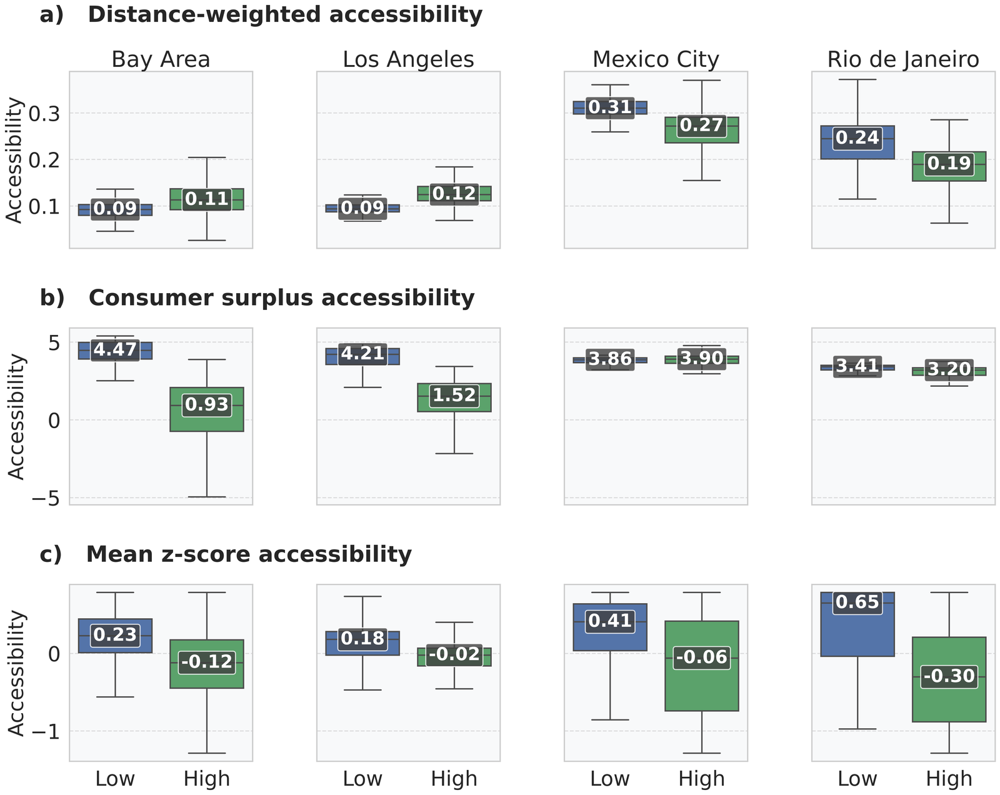
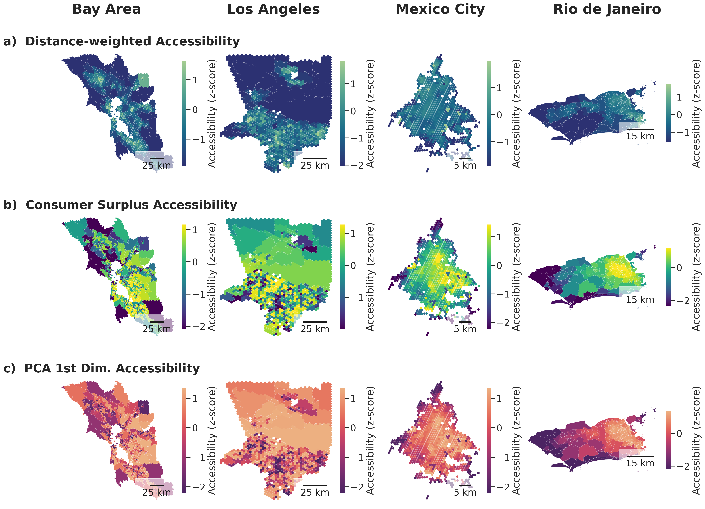

# The WorkReach model for urban work location choices through economic complexity and informality

## Abstract

Human mobility in urban areas largely depends on the spatial distribution of jobs and who pursues them, yet how workers balance proximity against economic opportunity remains poorly understood. Existing mechanistic models capture physically interpretable effects such as distance decay, but overlook how socioeconomic factors shape commuting decisions. We present WorkReach, a model grounded in discrete choice theory that embeds informality and economic complexity into a utility function and represents commuting as the outcome of workers behaving as if maximizing it. Applied to four cities in the United States, Mexico, and Brazil, it reproduces commuting flows as accurately as widely used benchmarks while making the underlying choices interpretable. Here, we show that workers consistently commute farther to economically sophisticated areas, while the role of informality differs across regions, and that measuring accessibility by the perceived benefit of opportunities, not just physical proximity, exposes disparities conventional metrics overlook.

## Overview

This repository contains the code and analysis for the WorkReach paper. A discrete choice framework that models urban work location choices by incorporating economic complexity, labor informality, and human mobility.

## Areas of Study

The analysis covers four major urban areas:
- San Francisco Bay Area, USA
- Los Angeles, USA
- Mexico City, Mexico
- Rio de Janeiro, Brazil

## Requirements

- Python 3.8+
- See `requirements.txt` for package dependencies

## Key Results

### Spatial Distribution of Economic Complexity and Informality

The four cities exhibit distinct spatial patterns in both Economic Complexity Index (ECI) and informality rates. Both variables show significant spatial autocorrelation, with Latin American cities displaying moderate negative correlation between informality and ECI (ρ ∼ −0.4), indicating spatial segregation where informal workers live far from high-complexity economic areas. In contrast, U.S. cities show near-zero correlation (ρ ∼ 0), suggesting more mixed spatial arrangements.

### Multi-scale Economic Structure and Mobility Patterns

The analysis reveals distinct specialization patterns across cities, with the Bay Area showing higher Product Complexity Index (PCI) in information sectors. U.S. cities exhibit longer commute distances, while disaggregating by socioeconomic characteristics shows that workers from high-informality areas in Latin America travel farthest to reach high-ECI destinations, whereas in U.S. cities, the longest commutes are made by workers from low-informality areas.

### WorkReach Model Framework

The WorkReach model integrates commuting distance, economic complexity, and informality into a utility function with a behavioral transition mechanism. The model distinguishes between "near-by" and "far-away" regimes based on a distance threshold τ, where socioeconomic factors (ECI and informality) become increasingly important for distant work choices.

### Model Performance Comparison

WorkReach achieves competitive performance with established spatial interaction models across all four cities. The model demonstrates comparable predictive accuracy while providing enhanced interpretability through behavioral coefficients that reveal how workers trade distance for job quality.

### Accessibility Analysis

Distance-weighted accessibility shows contrasting patterns: U.S. cities exhibit higher median values for high-informality neighborhoods, while Latin American cities show the opposite. However, consumer-surplus accessibility (incorporating job quality and behavioral preferences) shows lower values for high-informality origins in every city except Mexico City, revealing disparities masked by purely distance-based measures.

The spatial distribution of accessibility measures reveals peripheral locations, especially in western Rio de Janeiro, as the most underserved areas. The combined accessibility measure (PCA first dimension) identifies regions with advantages or disadvantages in both physical proximity and utility-based attractiveness.

## Usage
Currently, the final to produce all results is in the `commuter_flows.qmd` file which is a Quarto notebook (using Python). You can run this file to reproduce the analysis and figures in the paper.

The notebooks under `src/SI` reproduce the Supplementary figures. They read the same
aggregated tables in `data/` and write to `figs/SI`.

## Data

`data/` holds the aggregated, analysis-ready tables. No individual-level record is
included in this repository.

| File | Contents |
| --- | --- |
| `h3_*.geojson`, `map_informality_eci.geojson` | Zone geometries with ECI, informality rate and population |
| `*_flows_*.csv` | Aggregated origin-destination commuting flows |
| `employment_*.csv` | Workers by zone and NAICS sector, used for the complexity measures |
| `workers_*.csv` | Workers by zone and harmonised sector, used for sectoral relatedness |
| `income_proxy_*.csv` | Mean and median wage per destination zone, with worker counts |

Sources by city. Employment and commuting data for the Bay Area and Los Angeles are
derived from Replica; the tables here are aggregates and carry no raw Replica data
or data extracts. Mexico City uses DENUE and the 2020 population census from INEGI,
with mobility from location-based services licensed from Quadrant. Rio de Janeiro uses
RAIS and the 2010 demographic census from IBGE, with the same mobility source. The
underlying licensed data cannot be redistributed and must be obtained from the
respective providers.

## Citation

The code in this repository is archived at [10.5281/zenodo.21924441](https://doi.org/10.5281/zenodo.21924441). The stay-detection pipeline used to infer home and work locations from raw traces is archived at [10.5281/zenodo.21924437](https://doi.org/10.5281/zenodo.21924437).

## Contact

For questions about the methodology or code, please open an issue in this repository.
